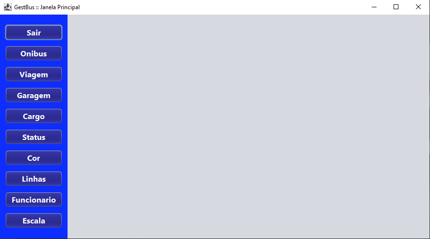
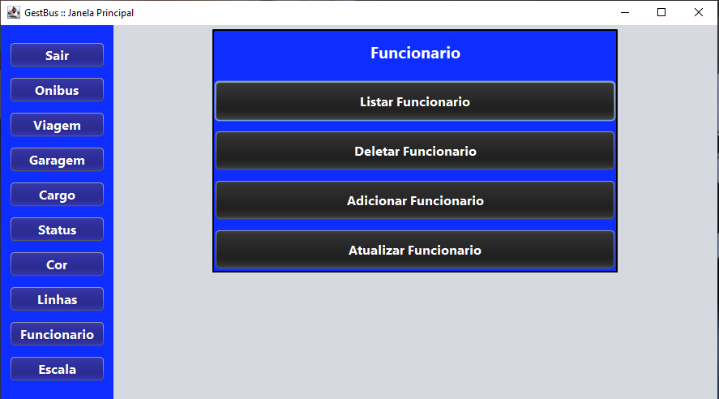

# GestBus
Projeto feito tem java(Swing) Conectado ao MYSQL utilizando o JDBC Usando
 o Maven para importa os 

## Descrição do Projeto
 Junção de 2 Atividades feito na sala de aula do senai de java swing e banco de dados eu reaproveitei e juntei os dois 
 Projeto feito tem java(Swing) Conectado ao MYSQL utilizando o JDBC Usando o Maven para importa os 

## Telas do Sistema

### Tela Principal

### Tela de Operações Crud

 ## Ferramentas Utilizadas
 - Linguagem java
 - Java Swing
 - Maven
 - JDBC
 - MYSQL
 - Padrões DAO

 ## Funcionalidades
 - [x] Crud Status
 - [x] Crud Cor
 - [x] Crud Cargo
 - [x] Crud Escala
 - [x] Crud Funcionario
 - [x] Crud Garagem
 - [x] Crud Linha
 - [x] Crud Onibus
 - [x] Crud Viagem

 ## Funcionalidade de Cada Obra
  Create - Adicionar Novo Registro
  Read   - Ler o Registro
  Update - Atualizar Registro
  Delete - Deletar Registro
 
## Status
 | Fases | Progressão | Status |
 | :--- | :---: | ---: |
 |**Telas** | 100% | Concluído |
 |**Fase de Teste** | 100% | Concluído |

**Projeto Finalizado**

O projeto foi concluído com sucesso, abrangendo todas as funcionalidades planejadas:

*Última atualização: [29/06/2026]*

## Observação
 Este projeto foi sendo desenvolvido com foco em portfólio e para
 juntar as tecnologia de java e mysql 

